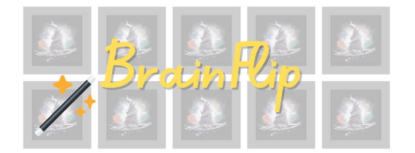

# Brain Flip
BrainFlip is a project born from months of collaboration between my teammate and me at ALX Program; we have been working together on all Team Projects. 

Inspired by our desire to create a fun and engaging way to improve memory skills, and with a shared love for Harry Potter, we decided to theme our memory game around this magical world. 

As a Portfolio Project for ALX, we are eager to share our journey and we hope you enjoy playing BrainFlip as much as we enjoyed creating it!

## Table of Content
* [Introduction](#Introduction)
* [Installation](#Installation)
* [Usage](#Usage)
* [Contributing](#Contributing)
* [Related projects](#Related_projects)
* [Bugs](#bugs)
* [Authors](#authors)
* [License](#license)

## Introduction
BrainFlip is a web-based memory game designed to enhance memory skills through engaging and interactive gameplay.

## Installation

## Usage

## contributing

## Related projects

## Bugs
No known bugs at this time.

## Authors
HebaM94 - hebamagde@gmail.com
HebaZaki - h_borhan@hotmail.com

## License
Public Domain. No copy write protection. 
